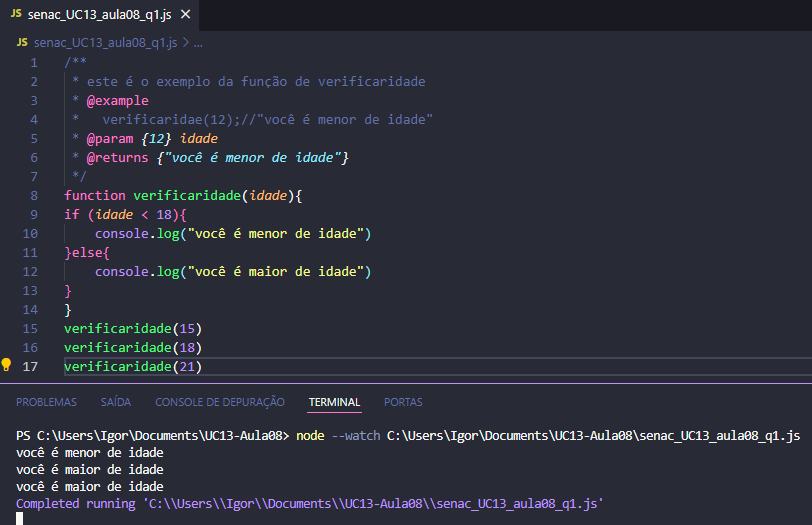
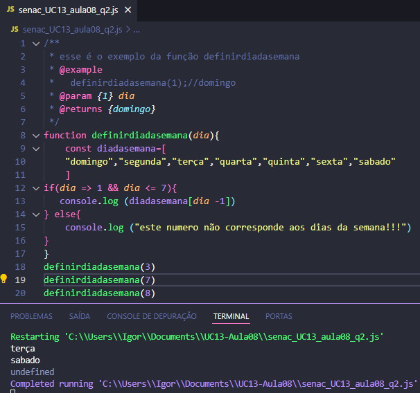
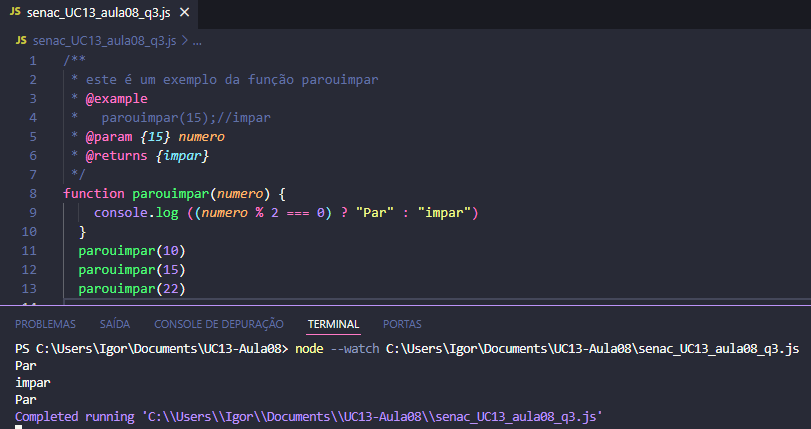
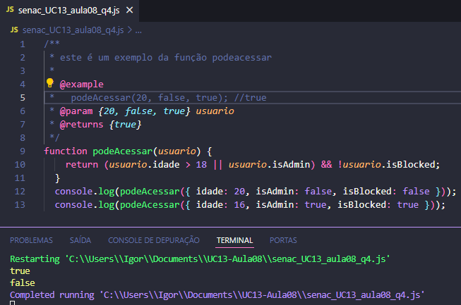
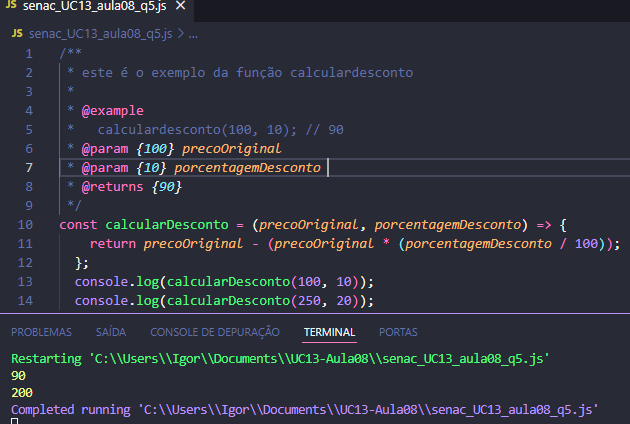

# UC13_AULA08: Revisão de javascript
### Aluno:Igor Pereira
### professor: Thiago Nogueira
### Data: 22/11/2024
## documentação dos exercicios
- Questão 1: Escreva uma função chamada verificarIdade que recebe um número como parâmetro representando a
idade de uma pessoa e retorna:
"Menor de idade" se a idade for menor que 18,
"Maior de idade" se a idade for 18 ou mais.

  
Essa questão se trata de um desenvolvimento de uma função para verificar a idade inserida, e para isso é usado uma simples comparação de if e else onde ele vai comparar se a idade inserida é menor que 18, caso seja menor ele vai imprimir "você é menor de idade" e caso seja maior ele ira imprimir "

- Questão 2: Crie uma função chamada "definirDiaDaSemana" que recebe um número (1 a 7) representando os dias da
semana. A função deve retornar o nome do dia correspondente:  
1 para ""Domingo"",  
2 para ""Segunda-feira"",  
e assim por diante até 7 para ""Sábado"".  
Caso o número seja inválido, retorne ""Número inválido"". Teste a função com os valores 3, 7 e 8.

  
Essa questão se trata do desenvolvimento de uma função para pecorrer um array e selecionar um dia da semana atravez do numero escolhido, e isso é feito a partir de um if e na hora de excutar subtrair menor um para dar o numero correspondente no array ao dia da semana correto.

- Questão 3:Implemente uma função chamada parOuImpar que recebe um número como parâmetro e utiliza um
operador ternário para retornar:
"Par" se o número for par
"Ímpar" caso contrário.

  
Essa é uma função basica com a intenção de dizer se um numero é par ou imapar, e isso é simplismente feito com a comparação de o numero é divisivel por 2, caso esse numero seja identificado como par e caso contrario sera considerado impar.

- Questão 4:Considere que você está verificando se um usuário pode acessar um sistema. Um usuário pode acessar o
sistema se:
1. For maior de 18 anos OU for administrador (propriedade isAdmin verdadeira).
2. A conta não estiver bloqueada (isBlocked deve ser falsa).
Implemente a função podeAcessar que recebe um objeto com as propriedades: idade, isAdmin, e
isBlocked. A função deve retornar true se o acesso for permitido e false caso contrário.

  
Se trata de uma função de validação de usuario para que ele possa ter os requisitos necessarios para acessar o sistema, e para garantir a segurança é validado a idade ou se ele faz parte da equipe adminstrativa e tambem é avaliado se ele esta bloqueado para ter acesso.

- Questão 5: Crie uma arrow function chamada calcularDesconto que recebe dois argumentos:
O preço original de um produto (número),
A porcentagem de desconto (número).
A função deve retornar o preço com o desconto aplicado.

  
É uma função criada para calcular o desconto do produto o diferencial dela é a maneira que foi desenvolvida utilizando um arrow function que é uma maneira simples de declarar uma função, e para um funcionamento dessa função é utilizado um processo de calculo de porcentagem onde se divide o valor do desconto por 100 depois se multiplica pelo valor original e esse resultado subtrai pelo valor original, assim gerando o valor do desconto.
